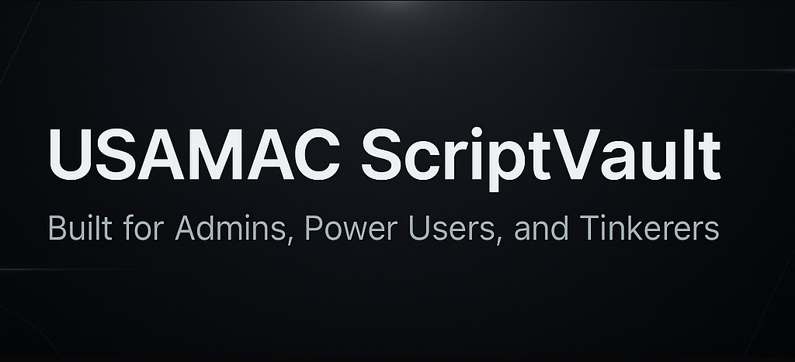

# 🧰 USAMAC ScriptVault


A growing collection of scripts for maintaining, diagnosing, and cleaning Windows systems. This is a live repository where tools are added, improved, and documented regularly.

---

## 📁 Current Tools

### 🧹 DeepClean
> A batch script that deeply cleans a Windows system — including temp files, logs, residual caches, and more. Supports logging and optional reboot prompt.

📂 [`DeepClean`](./DeepClean)

---

### 🔎 SysSummary
> PowerShell scripts that generate system summary reports — one full, and one privacy-safe for public sharing.

📂 [`SysSummary`](./SysSummary)

| Script Name           | Purpose                                  |
|-----------------------|------------------------------------------|
| `SysSum.ps1`          | Full system summary (includes hostname, MAC, BIOS serial, username, etc.) |
| `SysSum-Redac.ps1`    | Redacted summary for public use (sensitive data removed) |
| `README.md`           | Script details and instructions |

Both scripts generate `.txt` reports with:
- OS, CPU, RAM, GPU
- GPU Driver version/date
- Motherboard info
- Disk details
- Timestamp with timezone

---

## 🚀 How to Run the Scripts

> All PowerShell scripts require elevated (admin) execution.

```powershell
Set-ExecutionPolicy -Scope Process -ExecutionPolicy Bypass
.\ScriptName.ps1
